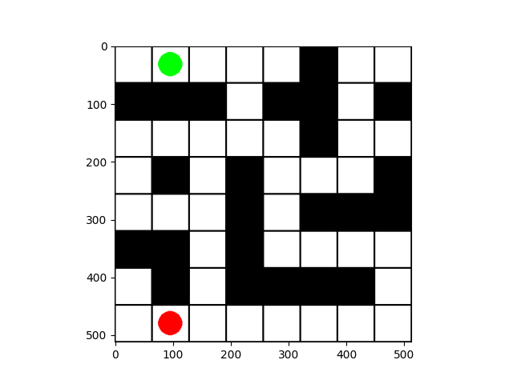

# GridMaze
A simple grid maze environment for reinforcement learning.  

## Getting Started
```
$ git clone https://github.com/ku-dmlab/grid_maze.git
$ cd grid_maze
$ pip install -e .
```
You can make pre-registerd `grid_maze` environments.
```
import gym
import gridmaze

env = gym.make("GridMaze-8x8-v0")
```


## Spaces
**Observation spaces**: a list of agent's location (x, y)  
**Action spaces**: UP, DOWN, LEFT, RIGHT